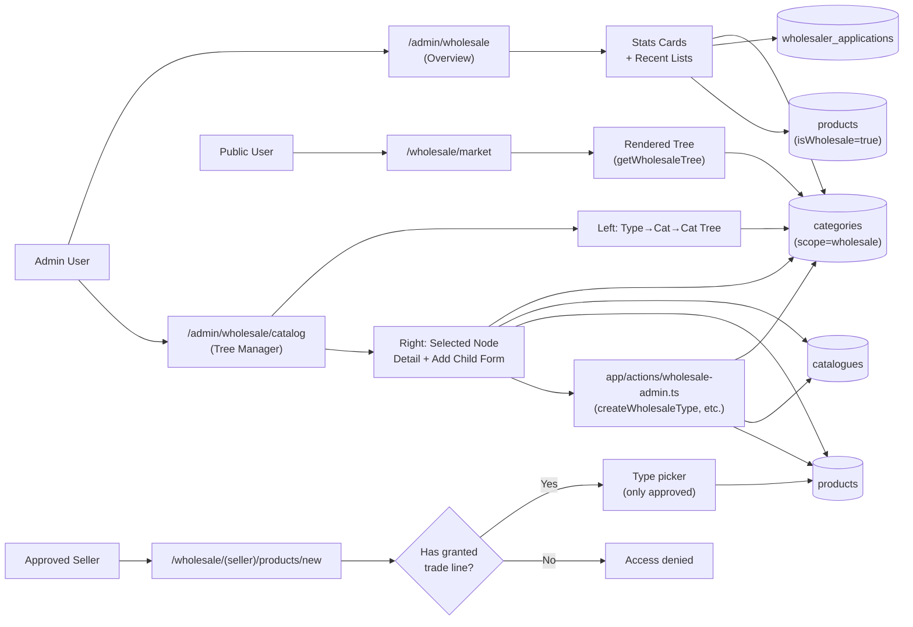
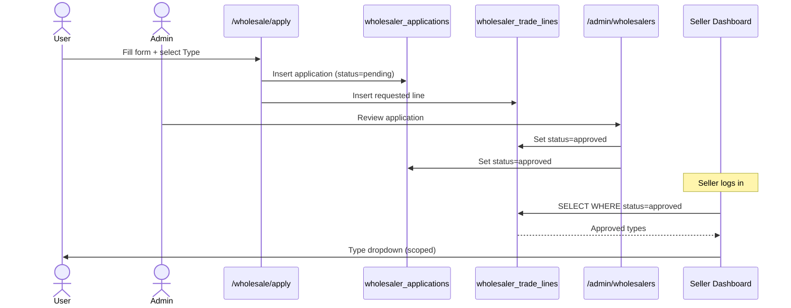
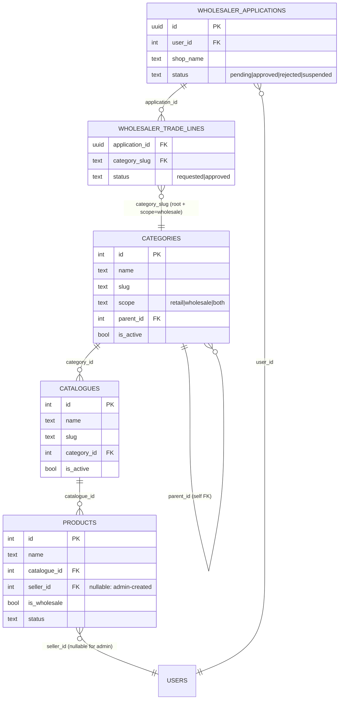

## Plan: Wholesale Admin Dashboard + Nested Catalog Manager

Admin dashboard এ নতুন `/admin/wholesale` route add হবে (overview cards + recent activity) এবং `/admin/wholesale/catalog` route এ Type → Category → Catalogue nested manager (left tree, right detail)। বাকি approval/settlement logic যেমন আছে তেমনই থাকবে; শুধু admin add-product form এ এখন Type+Category+Catalogue picker থাকবে যাতে admin যেকোনো wholesale product যোগ করতে পারে।

**TL;DR:** নতুন schema লাগবে না — existing `categories` (root + `scope=wholesale`) কে "Trade Line / Wholesale Type" হিসেবে, `categories` (non-root) কে "Category" হিসেবে, `catalogues` কে "Catalogue" হিসেবে reuse করা হবে। দুটো নতুন admin page + দুটো server action helper + nav update + seller-product form picker update ই scope।

---

### Steps

1. **(parallel) Wholesale scope helpers যোগ করা** — `lib/wholesale/scope.ts` নামে একটা নতুন file বানাও যেখানে helper functions থাকবে: `listWholesaleTypes()` (root categories যাদের scope=wholesale), `listWholesaleCategories(typeId)`, `listWholesaleCatalogues(categoryId)`, `getWholesaleTree()` (পুরো Type→Category→Catalogue tree admin manager এর জন্য)। `lib/products.ts` এর `getWholesaleLines()` pattern অনুসরণ করো।

2. **Sidebar nav update** — `lib/admin/nav.ts` এ `Sales` group এর মধ্যে "Wholesalers" item কে expand করো, child হিসেবে "Wholesale dashboard" (নতুন) এবং "Manage catalog" (নতুন) add করো। Current `Wholesalers` ও child হিসেবে "All applications" রাখো। নতুন children: `Dashboard`, `Manage catalog`, `All applications`, `All sellers`, `Product approvals`।

3. **(parallel) Wholesale overview page বানানো** — `app/admin/wholesale/page.tsx` create করো (`export const dynamic = 'force-dynamic'`); server-side ৪টা count query (`db.select({ count })`) চালাও — total sellers (status=approved), pending applications, total wholesale products (`isWholesale=true` flag বা catalogue scope দিয়ে), pending product approvals। উপরে ৪টা stat card নিচে ৩টা recent list: latest 5 applications, latest 5 pending products, latest 5 wholesale orders। Component: `components/admin/wholesale/wholesale-overview.tsx`।

4. **(parallel) Nested catalog manager page বানানো** — `app/admin/wholesale/catalog/page.tsx` এবং `app/admin/wholesale/catalog/[nodeId]/page.tsx` (selected node এর detail)। Left column এ `components/admin/wholesale/catalog-tree.tsx` (যেমন `components/categories/*` এ existing tree pattern আছে — সেটা reference করো) — collapsible tree: Type → Category → Catalogue, click করলে URL param `?node=...` সেট হবে। Right column এ `components/admin/wholesale/catalog-detail.tsx` — selected node এর info + "Add child" + "Rename" + "Toggle active" form। Add child form এ parent type বুঝে (Type হলে child হবে Category; Category হলে Catalogue; Catalogue হলে Product entry)।

5. **(parallel) Wholesale manager এর জন্য server actions** — `app/actions/wholesale-admin.ts` নতুন file এ: `createWholesaleType`, `renameWholesaleNode`, `setWholesaleNodeActive` (type/category/catalogue তিনটাতেই কাজ করবে polymorphic `kind` param দিয়ে), `createWholesaleCategory` (parentTypeId), `createWholesaleCatalogue` (parentCategoryId), `createWholesaleProductAdmin` (admin যেকোনো scope এ product add করতে পারবে — existing seller-only product action কে reuse করে শুধু seller_id null/inhouse রাখো বা admin হিসেবে existing product table এ add করো)। সব action `requireRole('admin')` guard করবে।

6. **(parallel) Wholesale product add form update** — Admin এর `/admin/products/new` page এর form (component: `components/product-form.tsx` বা যেটা আছে সেটা খুঁজে বের করো) এ Type→Category→Catalogue cascading dropdown যোগ করো, যেখানে admin শুধু wholesale scope এর category গুলোই দেখবে। যদি admin form আলাদা না হয়ে seller-product form reuse করে, তাহলে admin entry path এ শুধু `scope=wholesale` filter যোগ করো।

7. **(parallel) Seller product form এ permission check** — `app/actions/seller-products.ts` এ `createDraftWholesaleProduct` already আছে; ensure করো যে form এ Type picker এ শুধু `wholesalerTradeLines.status='approved'` row গুলোই আসবে (existing logic ঠিক থাকলে skip)। Component: `components/wholesale/seller-product-form.tsx` — dropdown data loader এ `getMyApprovedTradeLines()` helper call করো।

8. **Public wholesale page — tree display** — `/wholesale/market` (component: `components/wholesale/wholesale-market.tsx`) এ বর্তমান যে flat trade-line list আছে সেটাকে tree-style render করো (Type name bold, নিচে category list, নিচে catalogue list) — admin যা বানাবে exactly সেটাই দেখাবে। Read helper `getWholesaleTree()` reuse।

9. **Verification** —
   - `pnpm tsc --noEmit` zero error
   - `pnpm drizzle-kit check` (migrations clean — schema পরিবর্তন হচ্ছে না)
   - Manual: admin login → `/admin/wholesale` → 4 cards + 3 lists render → `/admin/wholesale/catalog` → বামে 3-level tree (Cloth → Men/Women → Jeans/T-Shirt...), ডানে selected node এর detail form কাজ করে। New type/category/catalogue create করে `/wholesale/market` এ verify যে নতুন tree দেখাচ্ছে। Seller হিসেবে login করে শুধু granted type এর dropdown আসছে কিনা confirm।
   - `get_errors` tool দিয়ে `/admin/wholesale` ও `/admin/wholesale/catalog` page এ কোনো type/lint error আসছে কিনা দেখো।

---

### Relevant files

- `app/admin/wholesale/page.tsx` (new) — overview cards + recent lists
- `app/admin/wholesale/catalog/page.tsx` (new) — nested catalog manager
- `app/admin/wholesale/catalog/[nodeId]/page.tsx` (new) — selected node detail
- `components/admin/wholesale/wholesale-overview.tsx` (new) — stat cards + lists
- `components/admin/wholesale/catalog-tree.tsx` (new) — left tree (mirror existing `components/categories/*` pattern)
- `components/admin/wholesale/catalog-detail.tsx` (new) — right detail + add-child form
- `app/actions/wholesale-admin.ts` (new) — admin catalog CRUD actions
- `lib/wholesale/scope.ts` (new) — read helpers (`listWholesaleTypes`, `getWholesaleTree`)
- `lib/admin/nav.ts` (update) — Wholesale nav children add
- `components/admin/admin-sidebar.tsx` (update if needed) — wired to `ADMIN_NAV`
- `app/admin/products/new/page.tsx` (update) — Type+Category+Catalogue cascading picker
- `components/product-form.tsx` বা similar admin product form (update) — cascading dropdown
- `components/wholesale/wholesale-market.tsx` (update) — tree-style render
- `app/actions/seller-products.ts` (verify, no change unless needed) — `createDraftWholesaleProduct` permission
- `components/wholesale/seller-product-form.tsx` (update) — only-approved-trade-lines dropdown

**Reuse patterns:**
- `lib/products.ts` → `getWholesaleLines()` for the "what is a wholesale line" query
- `components/categories/*` (existing admin categories tree) for catalog-tree.tsx layout
- `app/actions/admin/categories.ts` (or `app/actions/categories.ts`) for the create/rename/toggle action shape
- `app/admin/wholesalers/page.tsx` for the "applications table" pattern reuse in the recent-list

---

### Diagrams

**Architecture / data flow**

**Approval / permission sequence (seller side, unchanged)**

**Schema (relevant subset — no changes)**

---

### Verification

1. `pnpm tsc --noEmit` returns zero errors (no new schema, so migration churn is zero).
2. `pnpm drizzle-kit check` passes (no migration changes).
3. Manual as admin: `/admin/wholesale` shows correct counts; recent lists link to detail pages. `/admin/wholesale/catalog` left tree expands all 3 levels; right detail form creates a new type, then a category under it, then a catalogue under that, then a product under that.
4. Manual as public visitor: `/wholesale/market` shows the same 3-level tree.
5. Manual as approved seller: `/wholesale/(seller)/products/new` Type dropdown contains only approved trade lines.
6. `get_errors` on the two new admin pages shows no client/server boundary errors.
